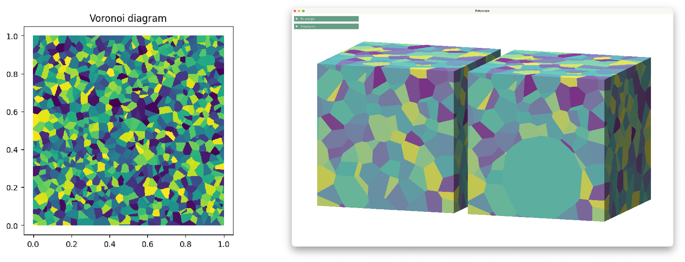
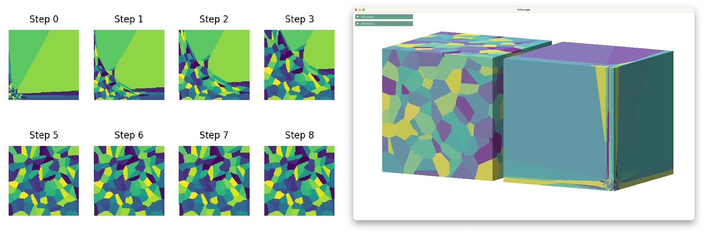

# pygeogram - examples

This folder contains several examples for `geogram`'s python interface:

- `voronoi-2d` and `voronoi-3d` compute and plot Voronoi and Laguerre diagrams.
- `transport-2d` and `transport-3d` solves a semi discrete optimal transport problem in 2D and 3D.
- `fluid-2d` relies on a semi discrete optimal transport solver to implement a very simple fluid simulator.

## Prerequisites

To install the required dependencies, one can rely on the following command:

```sh
pip install -r requirements.txt
```

## Screenshots

- `voronoi-2d` and `voronoi-3d`



- `transport-2d` and `transport-3d`



- `fluid-2d`


